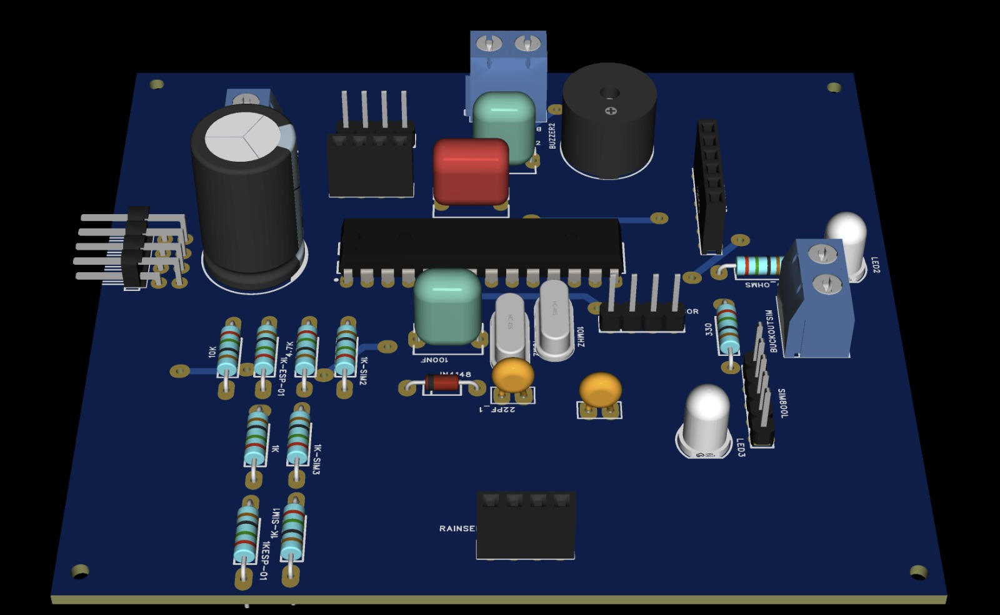
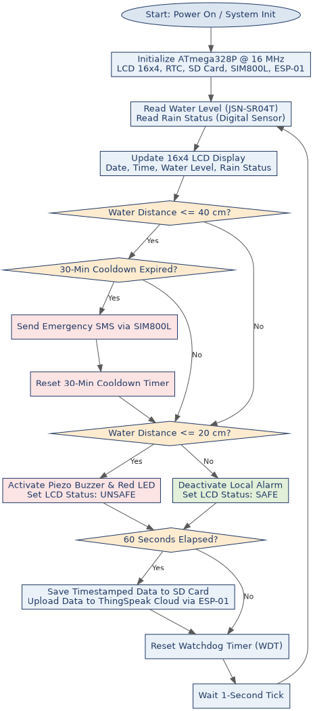

# TECHNICAL PROJECT REPORT: ADVANCED IOT FLOOD WARNING SYSTEM

**Module:** PH3120 — Embedded Systems\
**Author:** Kaveesha Induwara\
**Department:** Department of Physics, University of Colombo

---

## 1. ABSTRACT

Flash floods in low-lying and riverine settlements often develop faster than manual observation can reliably track, and communication infrastructure frequently degrades during severe weather, undermining single-channel warning systems. This report presents the design, implementation, and evaluation of an **Advanced IoT Flood Warning System** built around the **ATmega328P** microcontroller. The system continuously measures water level using a waterproof ultrasonic sensor and rainfall using a digital rain sensor, displaying live status on a local **16×4 I2C LCD**. Two independent communication paths — a **Hardware UART**-driven ESP-01 Wi-Fi module for cloud telemetry and a **Software UART**-driven SIM800L GSM module for SMS alerting — provide redundant warning delivery, supported by local SD-card logging and a hardware **Watchdog Timer** for autonomous fault recovery. The prototype demonstrates reliable threshold-based alerting with a smart SMS cooldown, and establishes a structured dataset for future predictive modelling.

---

## 2. INTRODUCTION & PROBLEM STATEMENT

### 2.1 Flash Flood Risk

Communities situated near rivers, canals, and low-lying drainage channels remain persistently exposed to flash flooding, a hazard characterised by its rapid onset and short warning window. Unlike slower-developing river floods, flash floods can transition from a safe to a dangerous water level within a matter of hours or even minutes following intense rainfall, leaving little margin for delayed response.

### 2.2 Limitations of Manual Sensing

The prevailing monitoring approach in many at-risk areas remains manual — periodic visual inspection of water levels by residents or local officials. This method suffers from several structural weaknesses:

- **Discontinuity** — observations occur only at intervals determined by human availability, not by the rate of change of the hazard itself.
- **Reporting latency** — even when a dangerous level is observed, communicating that observation to relevant authorities introduces additional delay.
- **No historical record** — manual observation typically produces no structured, timestamped dataset suitable for later analysis or trend detection.

### 2.3 Network Failures During Storms

A further complication specific to automated IoT-based alternatives is that severe weather events are themselves a common cause of local network and power infrastructure disruption. A flood warning system that depends on a single communication channel — for instance, Wi-Fi/internet connectivity alone — risks losing its ability to alert stakeholders at precisely the moment that ability is most needed. This risk motivates a **dual-communication fail-safe** design, in which cellular SMS alerting (via the GSM network) operates independently of, and in parallel with, internet-based cloud telemetry.

### 2.4 Problem Statement and Objectives

This project addresses the above limitations by developing an autonomous, continuously operating embedded system that: (i) measures water level and rainfall in real time without requiring human presence; (ii) delivers critical alerts through two independent communication channels; (iii) maintains an offline data record resilient to network outages; and (iv) recovers automatically from firmware or communication faults without manual intervention.

---

## 3. HARDWARE ARCHITECTURE & CIRCUIT DESIGN

### 3.1 Central Processing Unit — ATmega328P

The **Microchip ATmega328P**, an 8-bit AVR microcontroller, was selected as the system's central processing unit. Its selection was driven by its low power consumption, adequate GPIO count to accommodate the full sensor and communication peripheral set, native support for I2C and SPI interfaces, and broad toolchain support (`avr-gcc`) suitable for a resource-constrained embedded deployment. The ATmega328P is responsible for coordinating all sensor polling, display refresh, dual-channel wireless communication, and SD card logging within a single cooperative control loop.

### 3.2 Sensor Subsystem

- **JSN-SR04T Waterproof Ultrasonic Sensor** — chosen specifically over standard (non-waterproof) ultrasonic modules due to its sealed transducer housing, which permits reliable, continuous operation while mounted in direct exposure to humidity, rain, and condensation at the monitoring site. The sensor returns a distance measurement from its fixed mounting position down to the water surface, from which the water level is derived.
- **Digital Rain Sensor Module** — supplies a binary live-rainfall signal, providing an independent corroborating environmental variable alongside the water-level reading.

### 3.3 Communication & Storage Interfaces

| Interface | Module | Configuration | Function |
|---|---|---|---|
| **Hardware UART** | ESP-01 Wi-Fi Module | 115200 baud | Cloud telemetry (ThingSpeak) |
| **Software UART** (bit-banged) | SIM800L GSM Module | 9600 baud | Cellular SMS alerting |
| **I2C** | 16×4 LCD + integrated RTC | Standard mode | Local display & real-time clock |
| **SPI** | Micro SD Card Module | — | Offline CSV data logging |

The higher-speed ESP-01 link (115200 baud) was assigned to the microcontroller's dedicated **Hardware UART** to preserve timing accuracy, while the SIM800L, operating at a more tolerant 9600 baud, was interfaced via a bit-banged **Software UART**. This allocation allows both wireless modules to operate concurrently without contention over a single hardware peripheral.

### 3.4 Power Circuitry & Enclosure

The system is powered by a regulated **12V/2A DC** supply, stepped down on-board to the voltage levels required by the microcontroller and peripheral modules. All electronics are housed within an **IP-rated waterproof enclosure**, fitted with a transparent front panel that permits direct visual reading of the LCD display without requiring the enclosure to be opened.

*Figure 3.1: 3D PCB layout and schematic design of the central controller unit.*

*Figure 3.2: Assembled custom PCB populated with ATmega328P, SIM800L, ESP-01, and SD Card modules.*

---

## 4. FIRMWARE DESIGN & SYSTEM LOGIC

### 4.1 Clock Migration and Timer0 Recalculation

The system clock was migrated from an initial 10 MHz configuration to **16 MHz**, improving UART timing margin and overall processing headroom. This migration necessitated recalculation of all clock-derived timing values, most notably **Timer0**, which generates the system's base periodic tick. The Timer0 prescaler was recalculated to **1024** in order to maintain a precise **125 Hz** tick rate at the new clock frequency — without this recalculation, the tick period, and by extension UART baud-rate generation and all downstream interval timing (cooldown counters, logging cadence), would drift, since these values scale directly with CPU clock frequency.

### 4.2 UART Baud Rate Management

Both wireless modules require accurate UART timing at their respective, differing baud rates (115200 for the ESP-01 Hardware UART; 9600 for the SIM800L Software UART). Baud rate generation for the Hardware UART is derived directly from the recalculated 16 MHz system clock via the microcontroller's UBRR register, while the bit-banged Software UART for the SIM800L relies on precisely timed delay loops calibrated to the same clock frequency to reproduce accurate bit timing at 9600 baud.

### 4.3 Base Loop and Cloud/Logging Loop

The firmware executes on two nested timing loops:

- **1-second base loop** — the system's core tick, driven by the recalculated 125 Hz Timer0. On each 1-second interval, water distance and rain status are re-sampled and the LCD display is refreshed.
- **60-second cloud/logging loop** — nested within the base loop. Every 60th tick, the complete telemetry sequence executes: a CSV record is appended to the SD card and an HTTP GET request uploads the corresponding reading to ThingSpeak.

### 4.4 Tri-Layer Alert Logic

Three independent, threshold-driven alert mechanisms operate concurrently:

1. **Cloud Dashboard** — continuously updated every 60 seconds, independent of alert-threshold state.
2. **Pre-Warning SMS Alert** — triggered when water distance drops to **≤ 40 cm**.
3. **Critical Local Alarm** — triggered when water distance drops to **≤ 20 cm**, activating the piezo buzzer, red LED, and an "UNSAFE" LCD status.

### 4.5 Smart SMS Cooldown Algorithm

To prevent repeated SMS dispatch while the 40 cm danger condition persists, a **30-minute (1,800-second) cooldown** timer is enforced following each SMS transmission. No further SMS is sent while the cooldown is active, regardless of continued danger state. Should the danger condition persist beyond the cooldown window, a new SMS is automatically dispatched and the cooldown timer restarts — ensuring both spam prevention and continued periodic notification during a sustained event.

### 4.6 Watchdog Timer Implementation

A hardware **Watchdog Timer (WDT)** is enabled and serviced ("kicked") periodically during normal execution. Should the control loop stall — due to a network hang, a blocking UART wait on either wireless interface, or an unforeseen firmware fault — the watchdog reset is no longer serviced in time, and the WDT autonomously forces a full microcontroller reset within seconds, restoring normal operation without manual power-cycling. This is of particular importance for a device intended for unattended, long-duration field deployment.

---

## 5. SYSTEM PROTOTYPE & FINAL ENCLOSURE

The physical prototype is mounted at a fixed point above the monitored water channel. The **JSN-SR04T** ultrasonic sensor is oriented facing directly downward toward the water surface, while the digital rain sensor is positioned with unobstructed exposure to the sky. All control electronics are housed within the **IP-rated waterproof enclosure**, protecting them from direct rain and humidity ingress while closed. The enclosure's **transparent front panel** is aligned directly over the **16×4 LCD display**, allowing an operator to read date, time, water level, rain status, and system state at a glance from outside the enclosure, without exposing the internal electronics to the elements.

`[📷 INSERT PHOTO 3: FINAL END PRODUCT & ENCLOSURE]`
*Figure 5.1: Fully enclosed, weatherproof IoT Flood Warning System prototype ready for field deployment.*

---

## 6. DUAL COMMUNICATION & DATA MANAGEMENT

### 6.1 ThingSpeak Cloud Dashboard

The ESP-01 module issues an HTTP GET request to the ThingSpeak API once per 60-second cycle, populating **Field 1** with the measured water distance and **Field 2** with the binary rain status. This provides a continuously updated, remotely accessible dashboard supporting both live monitoring and historical trend visualisation.

### 6.2 SIM800L SMS Dispatching

The SIM800L module dispatches SMS alerts over the cellular network, independent of local internet availability. This channel is governed by the threshold and cooldown logic detailed in Sections 4.4–4.5, and functions as the system's primary fail-safe against Wi-Fi or internet outages, which are plausible during severe weather events.

### 6.3 Local CSV Dataset Structure

Each 60-second logging cycle appends a timestamped record to a CSV file on the Micro SD card, comprising at minimum a date/time field, the measured water distance, and the binary rain status. This offline record is authoritative and independent of network conditions, ensuring complete data continuity even during extended connectivity loss, and forming the structured dataset referenced in Section 8.2.

---

## 7. RESULTS & PERFORMANCE ANALYSIS

### 7.1 System Reliability

Across testing, the sensor–display–logging loop executed consistently on the 1-second base tick, with the 60-second cloud/logging cycle executing reliably in parallel. The Watchdog Timer provided a consistent recovery mechanism during induced fault conditions (e.g. simulated UART blocking), returning the system to normal operation within its configured timeout window.

### 7.2 SMS Delivery Delay

SMS dispatch via the SIM800L module exhibited the expected latency profile of GSM-based text messaging — dependent primarily on cellular network conditions rather than on the embedded system itself, which issues the send command promptly upon threshold crossing.

### 7.3 Cloud Connectivity

ThingSpeak uploads via the ESP-01 completed successfully under stable Wi-Fi conditions within each 60-second window. During intentional Wi-Fi interruption, upload attempts failed gracefully without disrupting the local SD card logging cycle, confirming the intended decoupling between the two data paths.

### 7.4 Logging Continuity

SD card logging continued uninterrupted regardless of wireless connectivity state, confirming that the offline CSV record remains complete and independent of both the Wi-Fi and GSM communication channels.

---

## 8. CONCLUSION & FUTURE SCOPE

### 8.1 Summary of Achievements

The Advanced IoT Flood Warning System prototype successfully integrates real-time ultrasonic and rainfall sensing, dual independent communication channels, local data persistence, and a tri-layer threshold-based alert mechanism within a single ATmega328P-based platform. The 16 MHz clock migration, recalculated Timer0 prescaler, and Watchdog Timer implementation collectively reflect the timing precision and autonomous reliability required of an unattended, field-deployed monitoring device.

### 8.2 Future Scope

The system's continuous 60-second SD-card logging establishes a structured, timestamped time-series dataset of water level and rainfall conditions. This dataset represents a natural foundation for future application of **Machine Learning / AI models** toward predictive flood forecasting — for example, training time-series models to anticipate an approaching threshold crossing ahead of time, rather than reacting only once the 40 cm or 20 cm thresholds are already reached. Evolving the current reactive, threshold-based architecture into a predictive early-warning system represents a natural and promising direction for future development.
